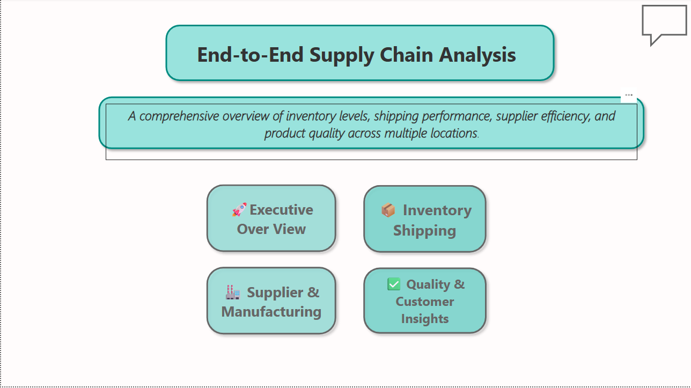
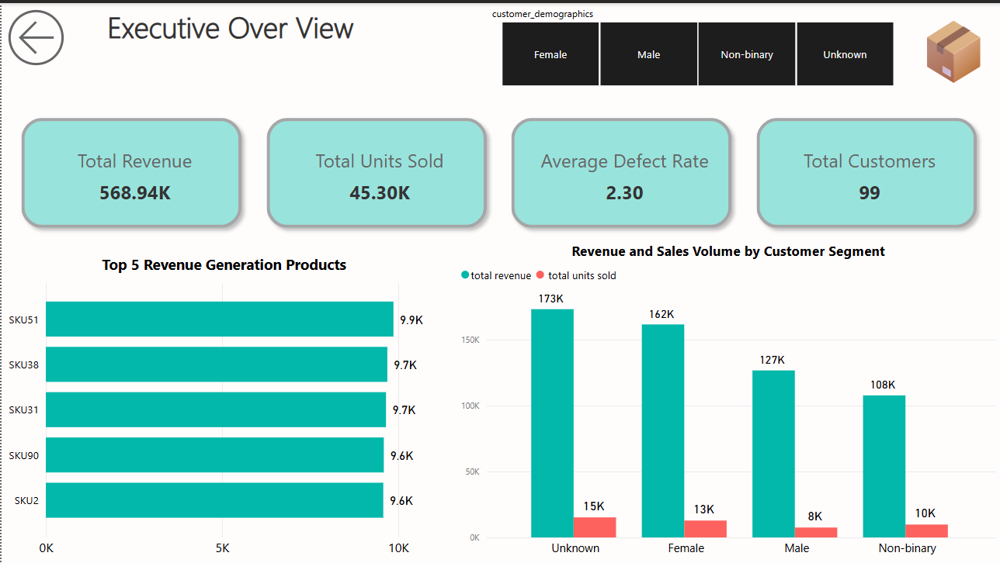
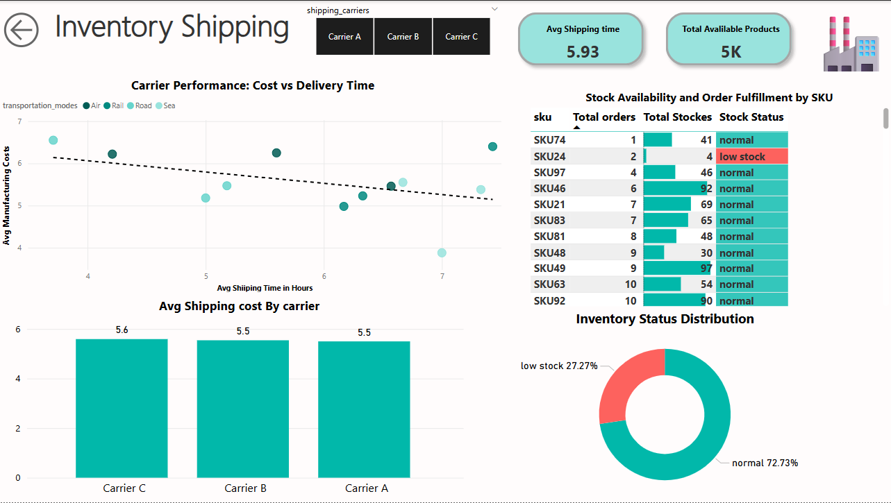
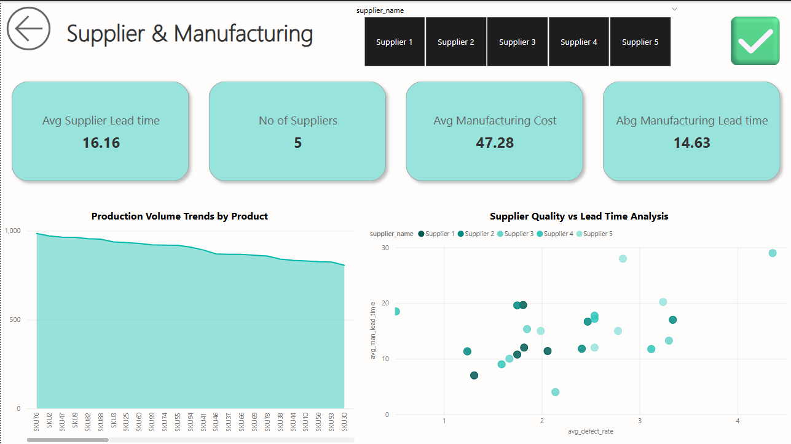
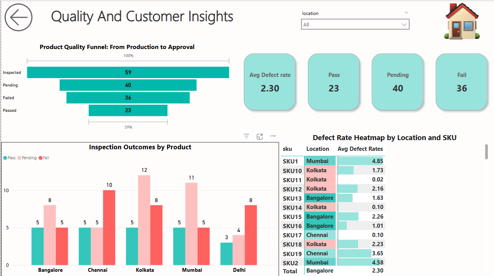

# 📦 Supply Chain Analytics Dashboard – SQL + Power BI

This project presents a **complete end-to-end supply chain analysis** using SQL and Power BI. From raw operational data, we developed meaningful insights into inventory risk, shipping performance, supplier efficiency, product quality, and customer behavior — all wrapped into a fully interactive dashboard.

---

## 🔍 Project Summary

- **Objective:** Analyze supply chain performance using real-world data and uncover key insights across inventory, manufacturing, shipping, and customer segments.
- **Tools Used:**  
  🛠 SQL (PostgreSQL – DBeaver)  
  📊 Power BI (for visualization & dashboarding)  
  🧼 Manual data cleaning (column renaming, resolving duplicates, resolving nulls)  
- **Data:** Supply chain transactional dataset with fields like SKU, stock levels, supplier details, manufacturing cost, shipping details, inspection results, etc.

---

## 🧱 Data Modeling

We created **custom SQL views** to simplify and structure the data for reporting. These views helped us establish **one-to-many relationships** and enable **dynamic page filtering** in Power BI.

### 📂 Created SQL Views:
1. **`product_sales_summary`** – Revenue, units sold, and average defect rate by SKU and location [(sqlfile)
](VIew_tables/products_sales_summary.sql)
2. **`inventory_risk_status`** – Inventory levels, reorder needs, and availability [(sql file)](VIew_tables/inventory_status.sql) 
3. **`supplier_performance`** – Lead time averages and supplier efficiency  [sql file](VIew_tables/supplier_metrics.sql)
4. **`shipping_summary`** – Shipping time, shipping cost, and delivery status  [sql file](VIew_tables/shipping_summary.sql)
5. **`route_cost_analysis`** – Transportation mode vs cost & time performance [sql file
](VIew_tables/route_analysis.sql) 
6. **`manufacturing_cost_trends`** – SKU-wise production volume and cost patterns [sql file](VIew_tables/mfg_trends.sql)  
7. **`product_quality_insights`** – Inspection outcomes, defect rates, and quality metrics  [sql file](VIew_tables/productin_qual_sum,sql.sql)
8. **`customer_insights`** – Customer segmentation by demographics and order trends [sql file](VIew_tables/customer_insights.sql)

---

## 📊 Power BI Dashboard Overview

We designed a **5-page interactive dashboard inculding a home page** , each focused on a critical area of the supply chain:

### 🟦 Page 0: **Home Page**

### 🟦 Page 1: **Executive Overview**
- Key KPIs: Revenue, Units Sold, Total Customers, Avg Defect Rate  
- Stacked column: Revenue & sales volume by customer type  
- Bar chart : Revenue generation products
- Page-level slicer: Customer demographics

### 🟧 Page 2: **Inventory & Shipping**
- Donut chart: Inventory status  
- Matrix: SKU × Location stock, reorder level, and status  
- Scatter chart: Avg shipping time vs cost (by carrier)  
- Clustered column: Avg shipping cost per carrier

### 🟩 Page 3: **Supplier & Manufacturing**
- Scatter chart: Supplier lead time vs defect rate   
- Area chart: Production volume by SKU  
- Slicer: Supplier name
- KPI cards

### 🟨 Page 4: **Product Quality & Customer Insights**
- 100% stacked bar: Pass/Fail/Pending inspection results  
- Matrix: Avg defect rate per SKU & location  
- KPI cards: Pass rate, fail rate, top defect-prone SKUs  
- Customer segment breakdown

---

## 📌 Key Learnings

- Designed star schema relationships to resolve **many-to-many joins** using dimension tables [(sql file)
](VIew_tables/dim_shpping_carriers.sql) 
- Used **DAX** to create KPIs like *Availability Rate* and *Inspected Units %*  
- Created responsive navigation buttons and slicers for seamless exploration  
- Applied conditional formatting in matrix visuals for **defect heatmaps**
